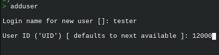

# installation-hacks

### TIPS

1. OK Slackware installation finish, time for your first reboot and for your first regular user. 
Assume you command `adduser` and now you are in `$user UID` prompt. 

Why you just hit enter and use as User ID ('UID') [ defaults to next available ]:`?`  
98% of Linux systems has first user id 1000 and next one 1001... **why ?**  
Give to your first user id up to 10000 and if some day you create more users they will follow...him.  
If I a cracker target a Linux system he know that 100{1,2,3} is user ID, lets make his life not so obviously... 
So, User ID ('UID') [ defaults to next available ]: 1200 (is a good example that crackers will not find it). 
**NOTE:** (Don't start users IDs up to 40000) its not wrong but not good practice for busy systems... 

---

 2. Don't add user to sudoers group. 
You don't need sudo. You don't even need root, but that's a long story...(that's a blasphemy for most Slackers)  
Just download [xudo](https://rizitis.github.io/slackware/binaries/xudo) some ware in your $PATH and that's all. 
If your user  know root password can execute any command need root access.  
example: `xudo slackpkg update` , `xudo ./some.SlackBuild` etc... 
To make it even better you can rename xudo to what ever you like, assume wns (WhoNeedSudo) ;) 
So lets do it `mv /usr/bin/xudo /usr/bin/wns`  
Now your commands should be: `wns slackpkg upgrade-all` , `wnd ./some.SlackBuild` , `wns ls /root` etc... ;)  

**Conclusion:** cracker don't know your user ID and cant guess it because its not `100?`, also you are not in sudoers group, you don't have sudo enable and you can even disable root but that's not for now...
Note: that with xudo or what ever you name it, during command is executed you are not in full root mode (su -l) exactly, but for sure after xudo finish you are back in $USER $PATH ;). 
So you can use xudo for everything if it full root mode is not hard depend...  
Also xudo do not work with slpkg, slpkg must always used in full root mode: 
`su -` 
`slpkg $cmd`

---

### Types of Security issues

**Its very simple, they just want your system data** 

 
- Steel
- Corrupt
- Remove

**If target data cant be touched, next target is Applications**

- Apache server
- Database (SQL,Orcale etc)
- Any other applications

**Host is next target**

- File Coraptions
- Complite shutdown
- Process Managent(CPU RAM)

**Last target is hardware**

- Attack CPU, RAM, external connected devices
  - Disable, remove, corrupt them

---

#### LINUX

Now days things are very complicate. Linux systems are not KISS systems, and modern  philosophy is more close to windows boxes than old UNIX... 

*Thats why I dont like systemd:*  

1. Because log files must always be plain.txt files and not binaries files
  - So I can pipe them ... Not only for debug but mostly for security reasons...
If you can understand that then keep going here, else there is no reason loosing your time!

2. I dont like the way that distros configure systemd as a root commander and do things that kernel must do.

3. Also systems that are designed to be simple , with systemd using windows philosophy of interlocking depencencies,well thats the best way to break things.
  - So these systems or must have systemd or nothing! Really?

4. And one more question, who is now developing systemd?  hm...
  - How easy it is for developers to develop and modify systemd?  
 
 ---
 
 **PAM**  
 
   *Learn PAM, how it works and how you can modify things to connect your services/users etc...*
   - [x] Auth
   - [x] Account
   - [x] Password
   - [x] Session
   

>        ALSO:
>
>>   Requisite
>
>>   Required
>
>>   Sufficient
>
>>    optional
>

---

#### Investigate: 

`/lib64/security/` those modules and libs are speaking to system for get access 
Most module there are pre-build and come with your Linux system. But also new can be added there if needed. 
If this option was not included in PAM then we should rebuild pam every time new RSA token or other login method was out... 
I think `man pam_unix` is your friend... 

On the other hand all modules in `/lib64/security/` are encrypted so you cant find something, but what you can find is what modules your new installed package *call* (if so), *why* or *how*?. 
Then `man module_name` and **read** what this module do... 
Or are there any modules that you should add to your configuration...? 
    Remember pam is not only for logins but also for `/var/logs/` **read logs**... 

**Remember that first target is your data, in other words your information**

*You probably think now that I will say:*
- Dont install binaries
- Dont run AppImages
- Build your own packages..etc

    **I won`t** `:D` 
    
    Again, now days things are very complicate, Linux systems are not KISS systems,  
    and modern philosophy is more close to windows boxes than old UNIX... 
I mean yeah, **dont install everything from everyware and dont run varius scripts**  
but... thats not the real problem, real problem is that we *lost the path*...
 

**Did I said that  log files must always be txt files and not binaries files?** 
- So I can pipe them
-  use them in other apps
- read them
- edit them
   -  Not only for debug but mostly for develop and security reasons now days...
For the same reason `/etc` is the most important directory in a Linux system.
So command: `egrep -v "bash|false" /etc/passwd` and `egrep -v "bash|nologin" /etc/passwd`
Read and understand wtf is going on with your services, apps etc...
Thats things are more or the same important like from were you build or install packages now days.  

**Privilege**
1. Who gets what?
2. Who can access what?
3. How can access ?

*Always access you system and login manually don't store passwd in plain txt files* 
*Encrypt disk is ok but that's only for boot, after that?* 

*Specify what files needed to have access your user(s), and what limits:*
  -  User accounts
  -  File Systems
  -  System access
  -  System conf files
  -  OS network

All above must have carefully and manually configuration, speaking for personal pc...
We had speak earlier how to give smart ID to your first user in your Linux. 
 

*Learn how to read:* `cat /etc/group` 

*Something useful to learn is how can edit* `/etc/security/faillock.conf` and `/etc/pam.d/system-auth` since `old pam_tally2` is not in Slackware. 

*But more useful would be to understand* `/etc/default/useradd` and modify it exactly for your user needs  

*I almost forgot, one very unknown file for "regular" linux users that you must focus and learn, that's* `/etc/login.defs`

Hack your Slackware, read and understand ALL these files you and should secure your users as needed because **Slackware** is  not only the best Linux distro, it is a learning machine...

 

 