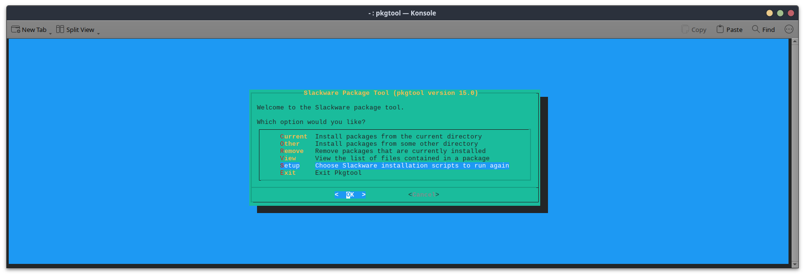
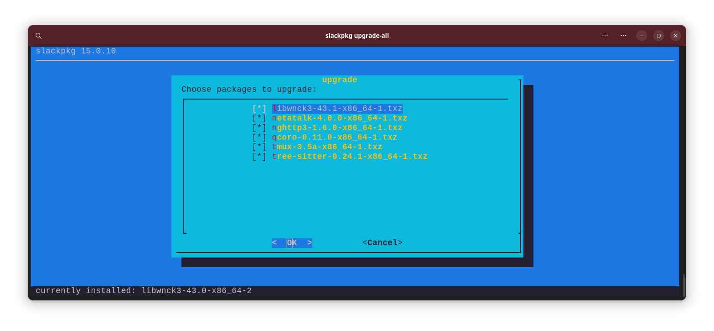
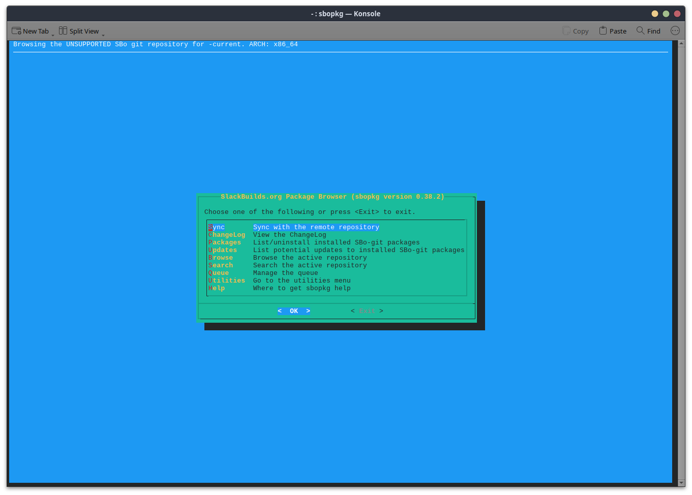
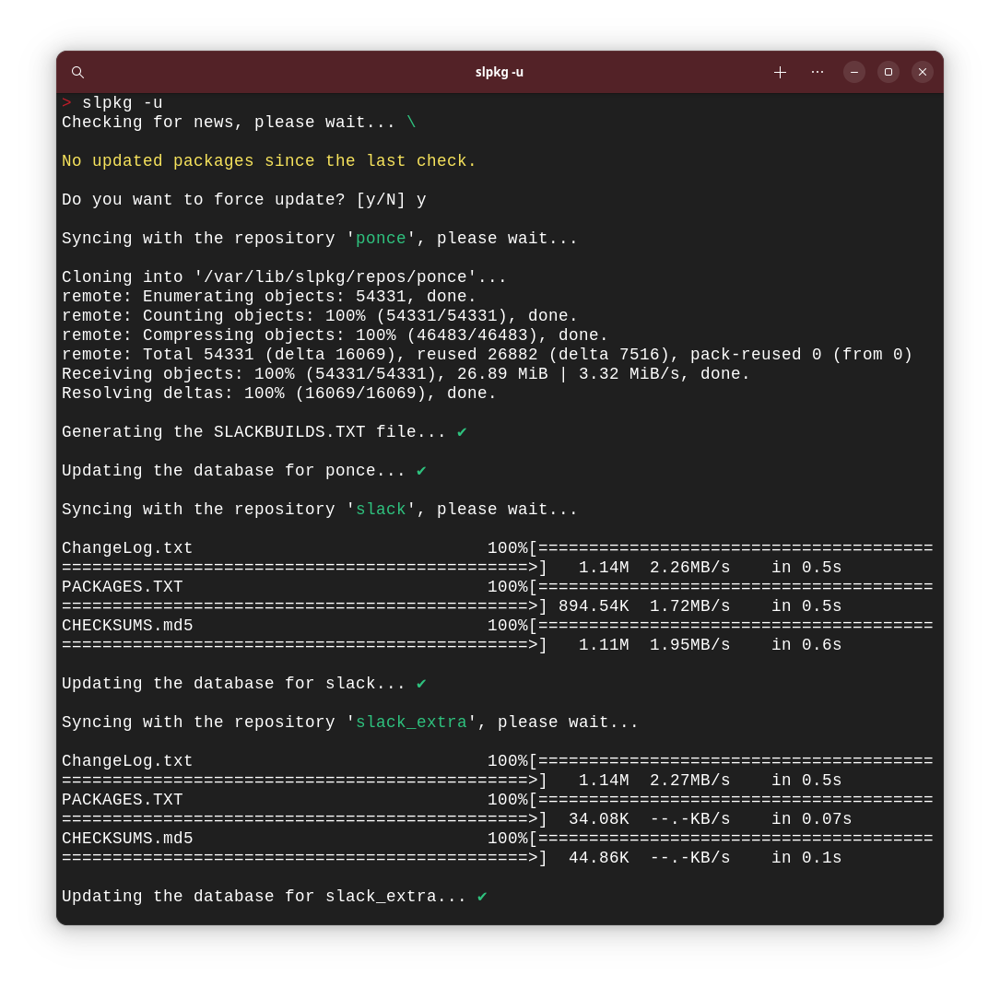

### Official Packages

Package Management for Slackware is a very special case. By default Slackware depends you install all packages provided in Slackware.ISO.<br>
That means you need to have a full Slackware installation for having all Slackware quality *enabled* in your system.   <br>
Of course you are free to skip some packages during installation but that's not a guaranty that system will work as accepted if you do it...


What we can say in one line is:<br>
Everything provided as `SlackBuild` script or precompiled Slackware package `(tgz,txz,tlz...)` out of Slackware.ISO **is not official**.
 <p>
 
---

### Package Manager

Slackware don't have officially package manager, officially it have a collection of bash scripts for maintain the system.<br>
 User can install,update,upgrade,remove packages from system using this collection of scripts `(pkgtools)`. <br> 
 
 
 
 What is called package manager `(slackpkg)` is a collection of scripts that also interact with remote servers  `(it read them from /etc/slackpkg/mirrors)` for update , upgrade a Slackware system using the official patches or packages from those mirrors.  <br> 
So this is Slackware package manager, but its not what most people understand as Linux system package manager.<br>



**Why?**<br>

Because Slackware has the philosophy to not provide dependency resolution.  So `slackpkg` do not do it. Remember that everything a package need `(build dep or run time dep)` already included in the installation. Also remember that you did a full installation and if so then you have everything needed in its place. <br>
One other reason that `slackpkg` is not like other package managers is that  not editing config files. That's `$user or root` job. 

The funny thing is that Slackware is the distro with the most 3rd part package managers. <br>
Maybe is more than 15 last time i count them!   <br>

---

Here are the most famous:
1. [slackpkg+](https://github.com/zuno/slackpkgplus) [(its a plugin for slackpkg)](https://slackware.nl/slakfinder/)
2. [slapt-get](https://github.com/jaos/slapt-get) 
3. [sbopkg](https://sbopkg.org/) (only for SlackBuilds building from Slackbuilds.org)
4.  [slpkg](https://gitlab.com/dslackw/slpkg)

---

#### sbopkg

In my opinion sbopkg is a must for every Slackware system. And it should be by default in officially Slackware.ISO. But  PAT answered to this request :**Forget it**<br> 
so there is no chance for happening. :( <br>
As I said before sbopkg works only with [SlackBuilds.org](https://slackbuilds.org/) repo. This is unofficially community repo by volunteers but if we call it *officially* it not wrong. <br>
If we want to be honest, PAT doing great job but without SlackBuilds.org Slackware couldn't be a very useful OS now days... <br>
Everything a user need and its not already in the installation there is the place to find it. <br>  
Slackbuilds.org is the AUR of Slackware.<br>
sbopkg is a must because its bash written and has 0 deps. You just install it and rsync it with SBo repo (SlackBuilds.org) and thats all...<br>

Download
```
wget https://github.com/sbopkg/sbopkg/releases/download/0.38.2/sbopkg-0.38.2-noarch-1_wsr.tgz
```
Install
```
installpkg sbopkg-0.38.2-noarch-1_wsr.tgz
```
As root start sbopkg and rsync it to the correct repo (default is for Slackware stable)
```
sbopkg
```



---

#### slpkg

The best over all package managers is [slpkg](https://gitlab.com/dslackw/slpkg). <br>
It works with:

- officiall packages repos
- Slackbuilds.org
- alienbob repos
- gfs (Gnome plasma6, cosmic, pantheon repos)
- any other valid Slackware repo exist.
- slint-salix-slackel repos  

So if you have sbopkg installed just command:<br>
`sqg -p slpkg && sbopkg -i slpkg`<br>
This way you will build and install slpkg from SlackBuilds.org with all its deps included. 




Next step is configuration of slpkg, you can find it [here](slpkg.md)
