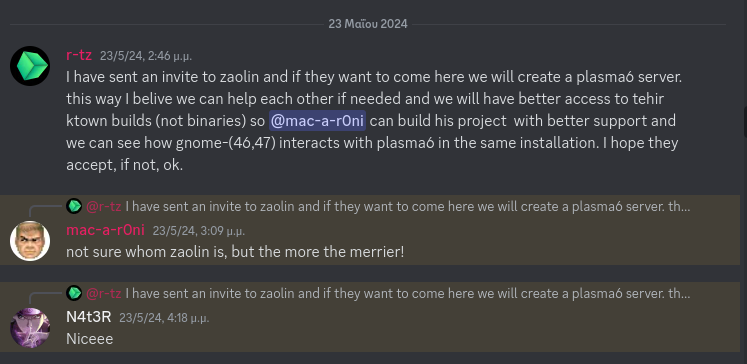

**I don't speak as a representative of anyone, only of my minion self.** 
*But I do not remain silent when consciences are undermined by false accusations.*

---

## Slackware-History

The history of slackware is so long that it is difficult to enter it as an individual name or as a group now days... 
The predecessors did work that cannot be underestimated! 
So anyone who contributes for glory and not for the community should know that they have set a difficult, if not impossible, goal...

---

### Verba volant, scripta manent

**1.**  Οn May 23rd I sent you a PM using LQ pm message box. 
I did this after this [post](https://www.linuxquestions.org/questions/slackware-14/building-the-plasma6-for-slackware-current-in-the-ktown-style-a-build-based-on-the-alienbob%27s-ktown-4175735773/page7.html#post6503292)  Where you discribed your techical issues (poor hardware and internet conection).
As you know PM included a link to the discord server and very politely wrote to you: 
*Inform Lucky about discord link and come there because we can and want to help you. Since we have powerful computers and the compilation will be done in a very short time. so Lucky can test his scripts **and** we will eventually help each other with gnome conflicts.* Besides, as I told you (scripta manent!), *there is no way we will **ever** use your binaries even though you didn't have them yet.* 
What did you did? 
You simply never replied. I remind you that Mr X had already stated for over 2 weeks that he uses the scripts for aarch64 [post](https://www.linuxquestions.org/questions/slackware-14/building-the-plasma6-for-slackware-current-in-the-ktown-style-a-build-based-on-the-alienbob%27s-ktown-4175735773/page2.html#post6500272) . 
So since you never replied and while the days were passing ... we asked Mr X to make public binaries for x86_64 as well.  
Why?  
Because we do professional job we must know **if** and **how** plasma6 conflicts with gnome47 **if are in the same slackware system installed**. 
**Cappito?** 
I think you don't dispute everything I say because its the true and **«Verba volant, scripta manent»**.  
`So I did sent the PM and you never replied. || exit 1`

**2.** In fact, because I, the fool as Lucky called all of us, always believed that you wanted to help, and you goal was the good of Slackware, *yes I'm a fool I admit it*, I made a post on Discord server and said to others:  
That I sent you an invitation.    Now take alook to image and open your eyes, can you see how the other *fools* and the *thief* Mr X welcomed the invitation...?  
 If someone had bad ideas for **YOUR** scripts not welcome do you think?
 ` || exit 2` 

That said, let the fairy tale and the egos end. If you do everything for glory, put a label glorify me and a big copy right on top. `|| exit 256`

### UNIX LESSONS

Let's move on now, because you also Master of the universe need, *from an idiot minion as you called us*, some UNIX history lessons anyway.

**U).**  The reason the systemd is bad is that it violates the unix philosophy. The one you **don't know** anymore is and learn it:  
**Log files** should and must can be piped. 
Oh yes, that's UNIX philosophy and not the KISS you all believe. 
KISS came **much later** to the fore of UNIX philoshophy. 
And do you know why they should be piped? Because that's how unix was developed. By clicking on **already existing programs and systems** that it piped and linking them with new ones of its own. 
That's how it was developed and that's how it became what it was and is.  
*NOT FROM SRATCH*. 
And this is called development and evolution into something new and better. 
 If you can't pipe, you stay stagnant and the product can't be improved nor can something new be created without having to build it from scratch in future. And thats what happened now with systemd. Linux will never be forked to something new or better as it is systemd or nothing because log files are *NOT* piped.

**N**. The same meaning is for your fork, exactly the same. And this is how your much-loved SUSE, for example, started! 
As a clone of Slackware, and over time it became this great and excellent distribution. 
As for your project, Mr X initially forked your scripts, *which were a fork of AlienBob*, and made them run on aarch64. 
Then because for 100 reasons, as you ignored us, as because he liked it, as because we asked him to, as because we dont trusted your future binaries and finally because he woke up one morning with this idea; he compiled them for x86_64 for public as well. 
And we added his repo in our **personal** slpkg toml or slackpkg+.conf, so we can installed and play with kde6 and gnome47 in the same system. 
The question is what exactly is your problem? 
Although when he himself has never announced for so many months that he has a repository x86_64? But even if he did, should he have gotten your permission? 
Didnt him mentioned you on his github? 
Or you had the persmission of AlienBob when you forked? 
If Mr.X wanted, couldn't he change at least the tag? What's so simple? 
He never thought that you will have this kind of mind. Sorry, it didn't cross our minds that the scripts and binaries should be preserved for the glory and worship of you. 
Who yes does a lot of work and in fact you had the glory, but once again you made a mess of it yourself. `|| exit 256`

**I)**. It's a shame because even I started using plasma6 after 20 years, because plasma6 need work to be stable but it's fucking awesome! 
And after all this, as a **real fool that I am**, I learned another lesson from you smart people.  BUT Just if you knew what work all of us fools and minions  do, how many projects we have built for slack completely quietly, as friends and an open group, you would probably be fuming with jealousy that you didn't get to take the glory. 
But what glory did you ever think about? The glory that you built a DE for a Linux distribution? `|| LOL` 
Reset your self, because geothermy and solar systems has more glory and money dont you think...? `2>&1  > /dev/null`  

We fools there have built more than 10 DE and WM, huh? so what? 
Me who hate systemd, tried hard to help a minion, who builded it for slackware, by forked one other project ofcource, because thats developing in open source.  Although he found solutions alone at the end, but I have no problem to help my friend. I m not a fanatic fool , just a fool minion...

**X)**. Learn that what remains when a person dies is not glory, it's a good soul, a good feeling.... for whoever has it.
What we did and what we do as fools we don't do for any benefit, neither material nor moral. We enjoy it and have fun with it, because we like to share knowledge, but above all a good conversation with each other and a help. Therefore, it is better to be foolish than to think that you are something when we are nothing in real. Because a person without good feelings is a casual figure of stardust with a finite breath.

PS. Friendly advice from a minion: try not to see your shadow because the sun makes you taller and maybe at some point you'll believe that this is your real height, when it's not.

---

### About discord server etc...

I created discord a few years ago, so I'm supposedly the leader of the fools and the rest are my minions. 
Why did I create it? 
Of course for my glory! It's **a big deal** to be the owner of a discord channel that almost no one in the community knows about! `|| hahaha!` 

Again: **«Verba volant, scripta manent»** 
[on Apr 20, 2022:](https://github.com/slackport/gfs/issues/8#issuecomment-1103574545)  
3-4 minions was building the same time Gnome 42 and since `github.com/slackport/gfs` was not active any more **BUT** every one of us **HAS FORKED** it... we couldnt find solutions to our issues. 
So I took the initiative to create a channel on discord platform so that we can share knowledge and help. 
This platform is easier for such jobs because you can have and share audio, images, upload scripts or compressed files in a few seconds, etc. 

Then after this [post](https://www.linuxquestions.org/questions/slackware-14/i-hope-slackers-like-this-video-no-matter-what-de-use-4175710204/) 
more hackers appears who was building gnome for slackware as you can see.  They also joined discord server (reason was for their glory i guess...) 
The funny thing was that **none** i repeat **NONE** was using gnome as main DE, haha!  
Even me was xfce4 since 1337 and *rearly* gnome DE user. 

Things developed ανδ οne day we decided to share roles and let everyone take on something, and where someone needs help, let them say so!<βρ>
1. So someone else took the build for Slackware 15.0 and also uploaded all the packages to SBo. 
2. Another the Slackware-current
3. Another the gnome live iso and aarch64  
 - and many others that I don't need to mention... 

Anyway, to not say much, everyone there offers something in various sections and we have a great time together. 
But on the start our first goal was to prepare gnome for sbo and this was done by a fool as you know.

But we were **not a church**, nor do we want anyone to **know or recognize us**.  
**Besides, the history of slackware is so long that it is difficult to enter it as an individual name or as a group now... The predecessors did work that cannot be underestimated!** 

### Fools and minions

Since as we met there I saw that I was talking to university professors or real hackers of code and life 
I understood that it was not right for me to own the server. I didn't feel good about it, as I was the weakest in all respects, I just talked more... 
So without thinking too much I left the owner one fine day and transferred the server to someone else. 
So yes, I am a minion now not a leader. 
But I couldn't help but be a proud, foolish minion, with such teachers and friends there from all over the world and all cultures. 
Of course most of us have at least 1 package each on SBo and we participate in irc to give 1$ extra to Slackware. 

---

### Conclusion

*What crowns man is sacrifice.*

-r

